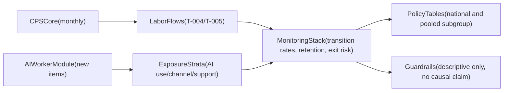

# CPS AI-Labor Extension Blueprint

## Objective

Design a feasible CPS extension that materially improves AI-and-labor measurement value while preserving current CPS strengths (frequency, representativeness, reproducibility).

## Design principles

- Keep burden low enough for realistic fielding.
- Reuse existing CPS concepts and weighting workflows.
- Produce outputs that plug into existing transition pipeline (`T-003` to `T-005` + exit-risk logic).
- Separate descriptive monitoring outputs from causal claims.

## A) Extension module set (focused, high-value)

## Module 1: Worker AI use intensity

- **Target universe:** employed civilian noninstitutional population age 16+.
- **Core variables (new):**
  - `AIUSE_ANY` (any AI use at work in reference period),
  - `AIUSE_FREQ` (frequency scale),
  - `AIUSE_TASK_SHARE` (share of tasks touched by AI in coarse bands).
- **Value add:** direct stratification of transition risks by actual reported AI use.
- **Feasibility:** high; short items, monthly or periodic module feasible.

## Module 2: Task channel classification

- **Core variables (new):**
  - `AICHANNEL_MAIN` (mostly augmentation, mostly substitution, both, neither/unsure),
  - `AIDOMAIN_PRIMARY` (content generation, coding/data, admin support, customer interaction, analytics/forecasting, other).
- **Value add:** separates "AI present" from "how AI changes work", critical for policy targeting.
- **Feasibility:** medium-high.

## Module 3: Employer adaptation and worker support

- **Core variables (new):**
  - `AITRAINING_OFFERED`,
  - `AITOOL_MANDATORY_OR_OPTIONAL`,
  - `ROLE_REDESIGN_INDICATOR`.
- **Value add:** links transitions to adaptation channel, not only exposure channel.
- **Feasibility:** medium.

## Module 4: Near-term perceived labor effects

- **Core variables (new):**
  - `AI_HOURS_EFFECT_3M`,
  - `AI_EARNINGS_EFFECT_3M`,
  - `AI_JOB_SECURITY_EFFECT_3M`.
- **Value add:** early warning indicators for displacement pressure and adjustment pain points.
- **Feasibility:** medium.

## Module 5 (optional): Rotating short panel follow-up

- **Approach:** ask a subset with AI module responses a limited follow-up sequence aligned with existing CPS rotation logic.
- **Value add:** stronger temporal sequencing for descriptive event-path analyses.
- **Feasibility:** medium-low relative to modules 1-4 due operational complexity.

## B) Measurement architecture

## C) Concrete proof-of-value tests

Each module should pass explicit tests against current baseline:

1. **Identification gain test**
   - Baseline: transitions only by occupation proxy groups.
   - Extension target: transitions by direct worker AI-use strata.
   - Pass criterion: stable, interpretable gradient across AI-use strata after pooling protocol.

2. **Precision and coverage test**
   - Baseline limitation: sparse cells for high-resolution cross-tabs.
   - Extension target: publishable estimates for national and pre-specified pooled subgroups.
   - Pass criterion: pre-defined minimum weighted denominator thresholds and confidence bounds.

3. **Policy actionability test**
   - Baseline output supports broad monitoring.
   - Extension target supports channel-specific intervention logic:
     - high use + low training,
     - substitution channel + elevated exits,
     - high perceived hours loss + weak retention.
   - Pass criterion: each policy-relevant risk pattern appears in reproducible public tables with metadata.

4. **Robustness and falsification test**
   - Check whether patterns persist under:
     - alternative pooling windows,
     - reweighting sensitivity checks,
     - exclusion of low-denominator cells.
   - Pass criterion: sign and rank-order stability of key comparative indicators.

## D) Output specification for implementation

If modules are fielded, add these outputs:

- `figures/cps_ai_module_worker_profile.csv`
- `figures/cps_ai_module_transition_strata.csv`
- `figures/cps_ai_module_training_channel.csv`
- `intermediate/cps_ai_module_run_metadata.json`
- `docs/t0xx_cps_ai_module_methodology.md`

Recommended schema elements:

- `month`, `ai_use_stratum`, `ai_channel`, `training_flag`, `origin_state_group`, `destination_state_group`,
- `weighted_count`, `origin_mass`, `transition_probability`,
- disclosure-safe denominator flags and pooled-window indicators.

## E) What remains unidentifiable after extension

This extension does not by itself identify:

- worker-firm matched causal impacts,
- firm-level treatment assignment effects,
- complete AI attribution free of concurrent macro shocks.

So outputs remain a high-value descriptive and risk-monitoring system, with stronger policy relevance than proxy-only CPS.

## F) Phased rollout

1. **Phase 0 (0-3 months):** cognitive testing and final item wording.
2. **Phase 1 (3-9 months):** initial fielding of modules 1-3, release technical note and first descriptive tables.
3. **Phase 2 (9-18 months):** add modules 4 and optional rotating follow-up pilot.
4. **Phase 3 (18+ months):** evaluate publication stability, denominator reliability, and integration with complementary public sources.

## G) Evidence links used to build this blueprint

- `docs/methods_data.md`
- `docs/t003_figure2_panelA_methodology.md`
- `docs/t005_figure2_panelB_probs_methodology.md`
- `docs/t013_figureA3_cps_supp_validation_methodology.md`
- `figures/figure2_panelB_transition_probs.csv`
- `figures/figureA3_cps_supp_validation.csv`
- `intermediate/figure2_panelB_counts_run_metadata.json`
- `intermediate/figure2_panelB_probs_run_metadata.json`
- `intermediate/cps_occ22_exit_risk_monthly_run_metadata.json`
- `docs/references/PublicUseDocumentation_final.pdf`
- `docs/references/cpsjan24.pdf`
